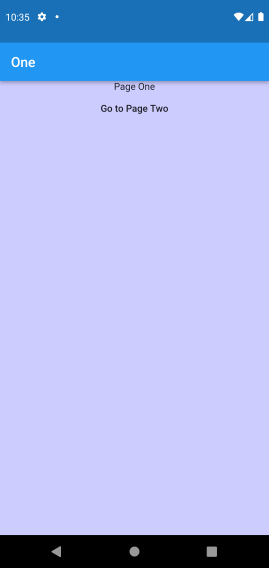
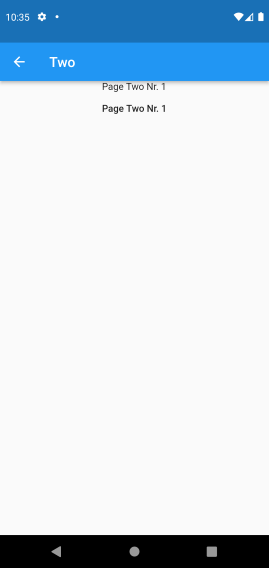

# Navigation

A Flutter Project, that demonstrates the Navigation functionality. Coded along side the book "App-Entwicklung mit Dart und Flutter 2" by "Dieter Meiller".

The app starts with PageOne and displays a Button, that navigates to PageTwo:

After pressing the button PageTwo is showed:

